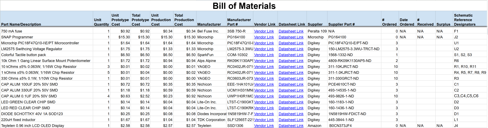

## Overview

Below is the Bill of Materials for the HMI subsystem including all of the major components like the microcontroller, OLED screen and the push buttons while also including all of the support materials like the resistors, capactiors, etc. The Bill of Materials includes the prices estimated for the required components as well as all of the required information about the product. It also shows the amount of each part that will be ordered and what component on thr schematic each ordered part is paired with.

### Bill of Materials

### PDF of Bill of Materials with links

- [PDF of Bill of Materials](EGR314_BOM.pdf)
