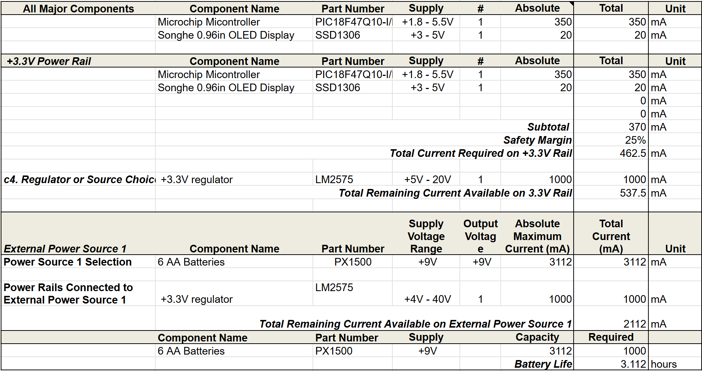

## Overview

Below is the power budget for the HMI subsystem. It includes the major component and the microcontroller and estimates how much power it would consume and how long the battery would last with just the one subsystem.

### Power Budget

