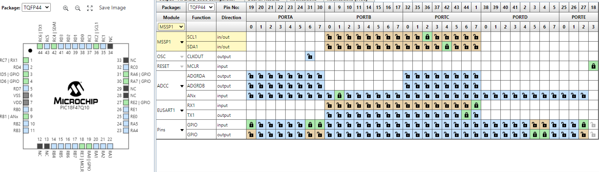

## Overview
Below all of the major components that are being used in the subsystem are shown with multiple devices that are being considered to be choosen. Each device has its pros and cons, then below each table is the device selection as well as an explination as to why it was selected. The microcontroller selection goes over the choosen microcontroller and why it was selected and how it will be used within the design.
 
 The power budget for the subsystem can be found here: [Power Budget](Power_Budget.md)

### Major Components

**Switching Voltage Regulator**

| **Solution**                                                                                                                                                                                      | **Pros**                                                                                                                                    | **Cons**                                                                                            |
| ------------------------------------------------------------------------------------------------------------------------------------------------------------------------------------------------- | ------------------------------------------------------------------------------------------------------------------------------------------- | --------------------------------------------------------------------------------------------------- |
|  Option 1  LM2575 Switching Voltage Regulator $1.75/each [link to product](https://www.digikey.com/en/products/detail/microchip-technology/LM2575-3-3WU-TR/1027646)           | \* Simple external circuit \* Small size  \* Meets surface mount constraint of project  \* Good data sheet | \* All pins are on one side \* really small                     |
|   Option 2   LT1767EMS8 Switching Voltage Regulator  $10.57/each   [Link to product](https://www.digikey.com/en/products/detail/analog-devices-inc/LT1767EMS8-3-3-TRPBF/958447) | \* Already has a circuit for 12v to 3.3v in its data sheet  \* Has a good pin layout                             | \* A lot more expensive  \* A complicated external circuit is required                  |
|   Option 3   L4971D Switching VOltage Regulator $3.70/each   [Link to product](https://www.digikey.com/en/products/detail/stmicroelectronics/L4971D/585932)                             | \* Midprice range  \* Adjustable voltage output                                                                     | \* A lot of pins  \* An external circuit with lots of components is required    |

**Choice:** Option 1: LM2575 Switching Voltage Regulator

**Rationale:** This switching voltage regulator emits an output of 3.3 volts when setup with an external circuit like shown in the detailed data sheet. The circuit is not complicated and does not require to many components externally. It also comes at a lower price than either of the other two options.It also allows a current operating range with a max of 1 A and a min voltage of 4 V with a max of 40V

**Push Buttons**

| **Solution**                                                                                                                                                                                      | **Pros**                                                                                                                                    | **Cons**                                                                                            |
| ------------------------------------------------------------------------------------------------------------------------------------------------------------------------------------------------- | ------------------------------------------------------------------------------------------------------------------------------------------- | --------------------------------------------------------------------------------------------------- |
|  Option 1  TS04-66-70-BK-160-SMT Surface Mount Push Button $0.17/each [link to product](https://www.digikey.com/en/products/detail/same-sky-formerly-cui-devices-/TS04-66-70-BK-160-SMT/15634372?gclsrc=aw.ds&&utm_adgroup=&utm_source=google&utm_medium=cpc&utm_campaign=PMax%20Shopping_Product_Low%20ROAS%20Categories&utm_term=&utm_content=&utm_id=go_cmp-20243063506_adg-_ad-__dev-c_ext-_prd-15634372_sig-CjwKCAiAzvC9BhADEiwAEhtlNzkufmbYSEAWr_kI4yTkDkaNGwd9HfJqmE0lOTE9BM8w-X6ChxQdthoC-fcQAvD_BwE&gad_source=1&gclid=CjwKCAiAzvC9BhADEiwAEhtlNzkufmbYSEAWr_kI4yTkDkaNGwd9HfJqmE0lOTE9BM8w-X6ChxQdthoC-fcQAvD_BwE&gclsrc=aw.ds)| \* Easy simple switch \* Small size \* Surface mount button | \* Not visually appealing  \* Might be to small so not as easily accessible for everyone to push |
|   Option 2   Gikfun Tact Tactile Push Button  $0.35/each   [Link to product](https://www.amazon.com/Gikfun-12x12x7-3-Tactile-Momentary-Arduino/dp/B01E38OS7K?source=ps-sl-shoppingads-lpcontext&ref_=fplfs&psc=1&smid=A34K5WF5Z9R33P&gQT=1) | \* Colorful buttons to allow for a more visual experience  \* big buttons to allow easy pushing for anyone  | \* Not specifically designed for surface mount but the leads can be bent to be surface mount  \*            |
|   Option 3   G3B15AB-XA Push Button Switch $0.81/each   [Link to product](https://www.digikey.com/en/products/detail/nkk-switches/G3B15AB-XA/1057221) | \* Bigger than the other swithces  \* Removeable cap that can be replaced with a different colored one | \* More expensive than other switches|

**Choice:** Option 2: Gikfun Tact Tactile Push Button

**Rationale:** This button is the best choice because it comes with different caps to allow easier pushing and to allow color labels on the button. The buttons also allowed for different variations of the caps that could include a label so that colorblind people can easily tell the buttons apart.

**OLED Screen**

| **Solution**                                                                                                                                                                                      | **Pros**                                                                                                                                    | **Cons**                                                                                            |
| ------------------------------------------------------------------------------------------------------------------------------------------------------------------------------------------------- | ------------------------------------------------------------------------------------------------------------------------------------------- | --------------------------------------------------------------------------------------------------- |
|   Option 1  Teyleten 0.96 inch LCD OLED Display   $2.58/each  [Link to product](https://www.amazon.com/Teyleten-Robot-Display-SSD1306-Raspberry/dp/B0CN373JF4) | \* Already provided in class  Will have experience using it | \* It is a small screen                    |
|    Option 2   GeeekPi OLED Display Module I2C 128x64 0.96 Inch Diplay Module Yellow BLue Two-Color Display   $5.00/each   [Link to product](https://www.amazon.com/GeeekPi-Display-Two-Color-Compatible-Raspberry/dp/B0B7RPCZ4Z/ref=asc_df_B0B7RPCZ4Z?mcid=7beb24d63196388983fb119ddae460a2&hvocijid=9232807348808548507-B0B7RPCZ4Z-&hvexpln=73&tag=hyprod-20&linkCode=df0&hvadid=721245378154&hvpos=&hvnetw=g&hvrand=9232807348808548507&hvpone=&hvptwo=&hvqmt=&hvdev=c&hvdvcmdl=&hvlocint=&hvlocphy=9194161&hvtargid=pla-2281435177578&psc=1) | \* Multi color screen   \* almost the same as the one used in class | \* Small screen  \* Requires different libraries than the one used in class |
   Option 3   MakerFoucs I2C OLED Display Module 0.91 Inch SSD1306 OLED Display Module White   $4.00/each   [Link to product](https://www.amazon.com/MakerFocus-Display-SSD1306-3-3V-5V-Arduino/dp/B079BN2J8V/ref=asc_df_B079BN2J8V?mcid=c49735976edc370c97f09dca149b17ae&hvocijid=9232807348808548507-B079BN2J8V-&hvexpln=73&tag=hyprod-20&linkCode=df0&hvadid=721245378154&hvpos=&hvnetw=g&hvrand=9232807348808548507&hvpone=&hvptwo=&hvqmt=&hvdev=c&hvdvcmdl=&hvlocint=&hvlocphy=9194161&hvtargid=pla-2281435175938&th=1) | \* Wider display to allow for longer sentences   \* Same library as OLED in class | \* Library requires different configureation   \* Not as much room vertically |

**Choice:** Option 1: Teyleten 0.96 inch LCD OLED Display Board

**Rationale:** The OLED screen is one that we have been given in class and have a lab that teaches us how to use it. Since the OLED is provided in class it will be free to use and gives more time to work with for debugging.

### Summary of Parts

The parts selected above were all choosen based off comparing ease of use with price as well with how they fit into the project requirements and with my team's project. The voltage regulator was choose for its easy use since we had already used it in class as well as its cheaper price point. The buttons were choosen for thier fun colors and their modular design to make the interacitivty of the project more appealing. And the OLED screen was choosen for the familiartiy of it as well as saving cost and time since it was a component that was already aquired. All of these parts are vital to making the HMI subsystem work and the whole project work.

### Microcontroller Selection

#### Reason for Selection
For my microcontroller I decided to go with the PIC18F47Q10-E/PT. This is the surface mount varient of the PIC18F47Q10 that we have used in class. Below is a table of all the information about the microcontroller.

| PIC Info                                | Answer |
| --------------------------------------- | ------ |
| Model                                   | PIC18F47Q10-E/PT |
| Product Page URL                        | [Product Page](https://www.microchip.com/en-us/product/pic18f47q10#Overview) |
| Datasheet URL                           | [Datasheet](https://ww1.microchip.com/downloads/en/DeviceDoc/PIC18F27-47Q10-Data-Sheet-40002043E.pdf) |
| Application Notes URL                   | [Application Notes](https://www.microchip.com/en-us/product/pic18f47q10#Design%20Resources) |
| Vendor Link                             | [Vendor Link](https://www.digikey.com/en/products/detail/microchip-technology/PIC18F47Q10-E-PT/12807473) |
| Code Examples                           | [Code Example GPIO Read/Write](https://github.com/microchip-pic-avr-examples/pic18f47q10-cnano-gpio-read-write-bare/tree/1.0.6)   [Code Example I2C Read/Write](https://github.com/microchip-pic-avr-examples/pic18f47q10-cnano-i2c-read-write-temp-sensor-mcc/tree/1.0.1) |
| External Resources                      | [Programming OLED screen with MPLabX and a PIC](https://embeddedlaboratory.blogspot.com/2018/02/oled-i2c-display-using-microchip-pic.html) |
| Unit Cost                               | $1.64 |
| Supply voltage range                    | 1.8V min to 5.5V max |
| Maximum GPIO Current (per pin)          | 50 mA |
| Supports External Interrupts            | Yes |
| Required Programming Hardwar, Cost, URL | [MPLAB SNAP](https://www.microchip.com/en-us/development-tool/PG164100)   Cost: $14.99 |
| Works with MPLabX                       | Yes |
| Works with Microchip Code Configurator  | Yes |

#### Role on the team
My role on my team is to design and make the Human Machine Interface (HMI). I plan on doing this by using 3 buttons, a potentiometer, 2 LEDs and an OLED screen. The buttons will allow the user to do simple interactions like start the object following process or control a menu system that is displayed on the OLED screen. The OLED screen is going to be used to display sensor data and prompt instructions to the user on how to use it. The potentiometer will allow the user to select from a range of values to adjust the following distance or the speed of the robot itself. The LEDs will light up when a action is happening for example the green LED might turn on when the robot is in object following mode.

#### Pins needed
For my subsystem I require 13 pins not including power and ground or programming pins. I will need 3 digital input pins, 1 ADC pin, 2 digital output pins, 2 pins for I2C connection, 2 for the UART connection, and then 3 pins for the SNAP programmer. The selected microcontroller 

| Module | # Available | Needed | Associated Pins |
| ------ | ----------- | ------ | --------------- |
| GPIO   | 25          | 5      | The button GPIO pins will be on Pins RA6, RA0 and RE2   The potentiometer will be on pin RB1   The two LEDs will be on pins RD5 and RD6 |
| ADC    | 25          | 1      | The potentiometer will be on pin RB1            |
| UART   | 2           | 1      | Rx on pin RC7   Tx on pin RC6 |
| SPI    | 2           | 0      | N/A             |
| I2C    | 2           | 2      | SCL1 on pin RC2   SDA1 on pin RC4 |
| PWM    | 2/2         | 0      | N/A             |
| ICSP   | 3           | 3      | MCLR is on RE3   ICSPDAT is on RB7   ICSPCLK is on RB6 |

##### MCC Pin Layout
Below is the pin selection screen in MCC showing all selected pins allocated. It shows the dedicated pins for UART, the I2C pins, the MCLR pin, the open pins for ICSPDAT and ICSPCLK, the ADC, and then all the GPIO pins dedicated to inputs and outputs respectivly. All the pins match the table above with the pin locations. On the left side of the picture it shows the layout of all the pins on the physical microcontroller. The pins are grouped togther in a way that allows space between each section and keeping like pins together for example the Rx and the upstream input are right next to each other while the Tx and the downstream output are next to each other and the two sections are right by each other.

##### MCC Microcontroller details
Below is the setup for the microcontroller where it also shows how many different applications that it can support with its pins.

#### Final Selection
I beleive that the PIC18F47Q10-E/PT is the best choice for my subsystem as it supports every function that I need to do while programing it in MPLabX makes it simple to do everything that I need to do for my subsystem. Its numerous pins allow for extra flexibility with my design and the pin selection process in MPLabX lets me visiualize where every connection will be and how they can be grouped together.

### Decision Making Process

I choose all the parts above to benefit the HMI subsystem as well as the team project as a whole. My parts follow the requirements for the HMI subsystem by allowing for user input through phyiscal means on my subsystem, having a stable voltage of 3.3V to power the microcontroller and other components, having a way to display information that is from other parts of the susbystem as well as my own, and having a PIC meeting the requirement of at least one PIC for the whole team project.

