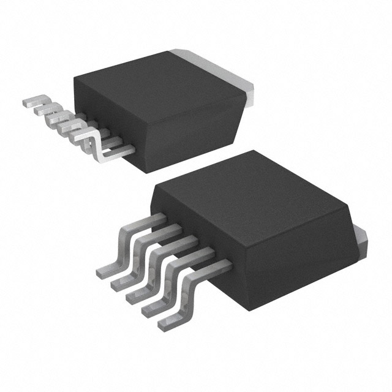

### Major Components

**Switching Voltage Regulator**

| **Solution**                                                                                                                                                                                      | **Pros**                                                                                                                                    | **Cons**                                                                                            |
| ------------------------------------------------------------------------------------------------------------------------------------------------------------------------------------------------- | ------------------------------------------------------------------------------------------------------------------------------------------- | --------------------------------------------------------------------------------------------------- |
|  Option 1.  SI-8033JD Switching Voltage Regulator $2.10/each [link to product](https://www.digikey.com/en/products/detail/sanken-electric-usa-inc/SI-8033JD/5699929)           | \* Simple external circuit \* Small size  \* Meets surface mount constraint of project  \* Good data sheet | \* All pins are on one side \* really small                     |
|   Option 2   LT1767EMS8 Switching Voltage Regulator  $10.57/each   [Link to product](https://www.digikey.com/en/products/detail/analog-devices-inc/LT1767EMS8-3-3-TRPBF/958447) | \* Already has a circuit for 12v to 3.3v in its data sheet  \* Has a good pin layout                             | \* A lot more expensive  \* A complicated external circuit is required                  |
|   Option 3   LT1767EMS8 Switching Voltage Regulator  $3.70/each   [Link to product](https://www.digikey.com/en/products/detail/stmicroelectronics/L4971D/585932)                    | \* Midprice range  \* Adjustable voltage output                                                                     | \* A lot of pins  \* An external circuit with lots of components is required    |

**Choice:** Option 1: SI-8033JD Switching Voltage Regulator

**Rationale:** This swotching voltage regulator emits an output of 3.3 volts when setup with an external circuit like shown in the detailed data sheet. The circuit is not complicated and does not require to many components externally. It also comes at a lower price than either of the other two options.It also allows a current operating range with a max of 1.5 A and a min voltage of 6.3 V with a max of 40V
