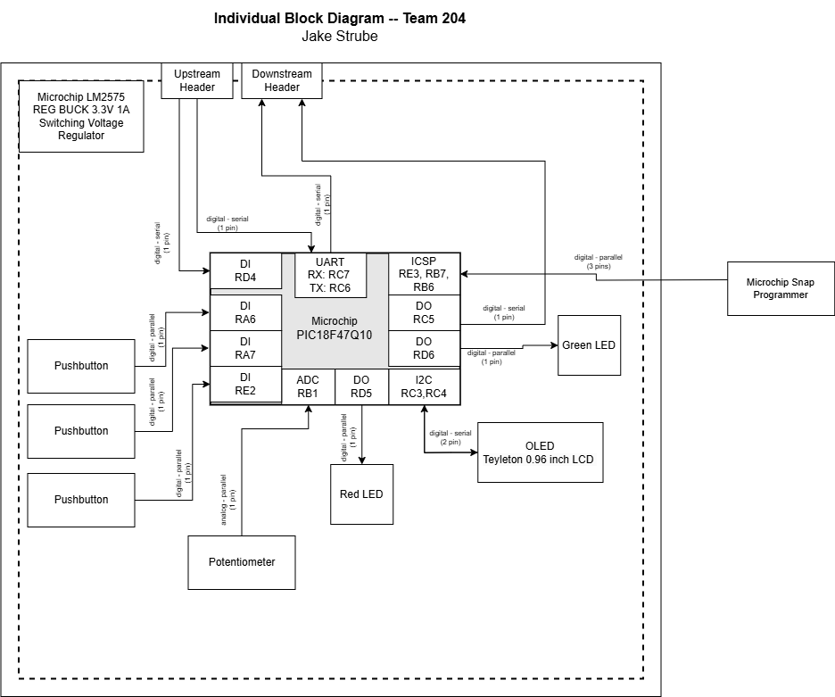

## Block Diagram

### Overview
Below is the individual block diagram for my component of my team's project. My component is the HMI (Human Machine Interface). The block diagram includes 3 pushbuttons to allow for user input for quick actions, various LEDs to allow for debugging and to let the user know when a function is happening, a potentionmeter to allow a user to select through a range of values, and an OLED screen to display sensor values and allow the user to see what each button does while also providing short instructions on what the user can do next. The microcontroller choose is the PIC18F47Q10 programmed by the Microchip SNAP programmer. All of this is powered by a 3.3V switching power regulator and connects via UART to the rest of my team's PCBs. Each component is shown on the block diagram below along with their connections and type of connection with the number for pins that the component will use.

### Block Diagram

