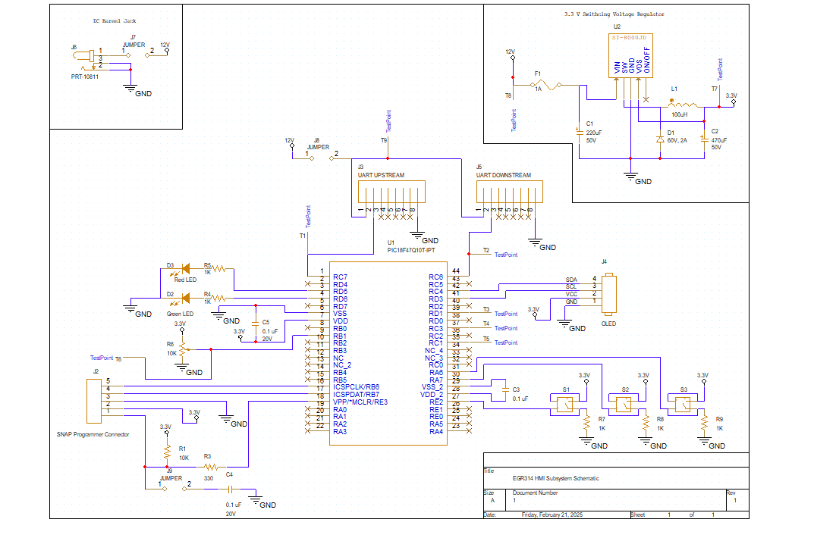

## Schematic Overview

Below is the schematic for the HMI subsystem for team 204. It is split into 3 different sections. The barrel jack to connect to a power soure, the 3.3V voltage regulator, and the microcontroller with all its peripherals. 

### Schematic

#### Higher Resoultion Image
A higher resoultion image can be found in this [PDF of schematic.](HMI_Subsystem.pdf)