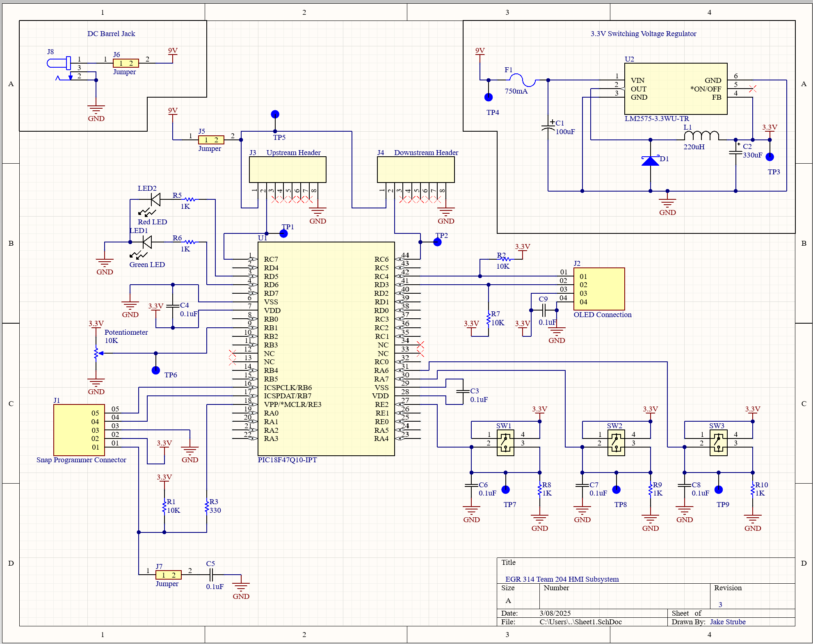
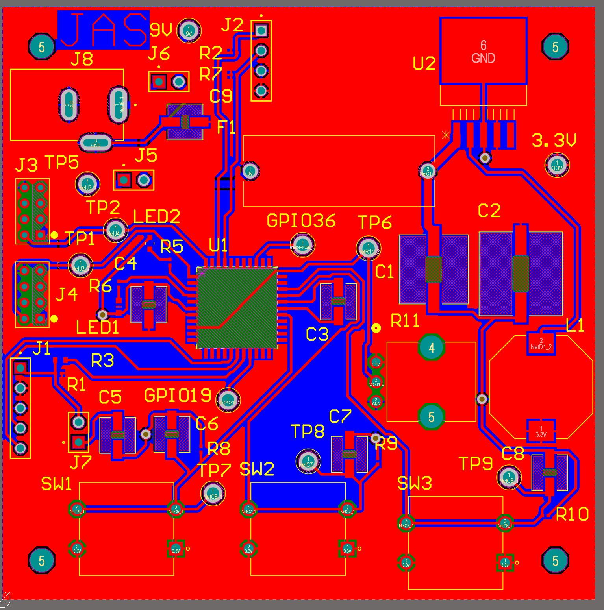
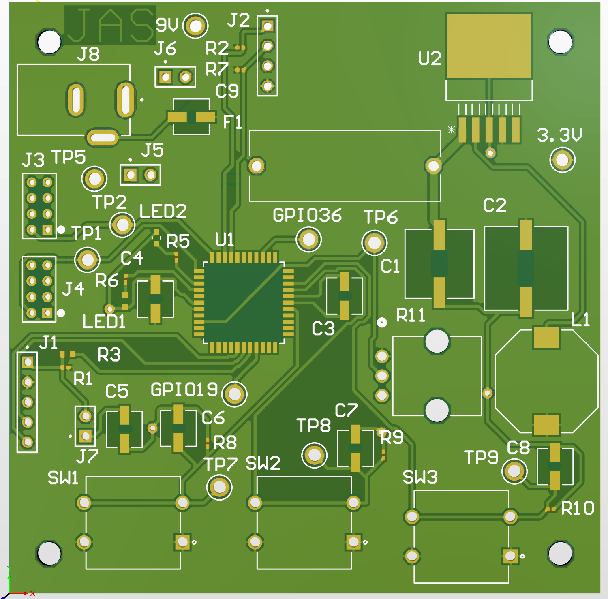
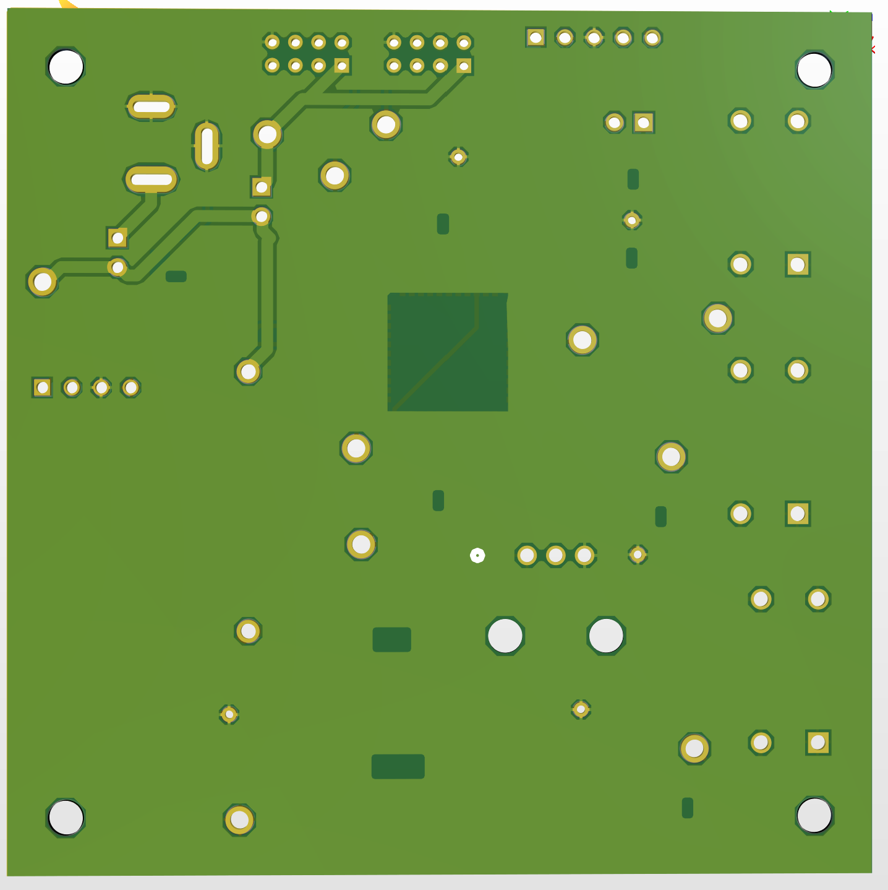

## Schematic Overview

The schematic for Team 204’s HMI subsystem is divided into three main sections: power input, voltage regulation, and the microcontroller with its peripherals. Power is supplied through a barrel jack that connects to an external source and includes a jumper that allows the system to operate independently or as part of a shared power system. The upstream and downstream connectors have a power transfer line that enables 9V to be shared between subsystems. A jumper on this line allows the group power to be disconnected so the board can run on its own power supply. The voltage regulator section in the top right of the schematic receives 9V from either the barrel jack or group power. It passes through a fuse for overload protection before being stepped down to 3.3V to power the microcontroller, OLED screen, and other components. The microcontroller section features three buttons and a potentiometer for user input along with two LEDs, one red and one green, that indicate system activity and provide real-time feedback. To the right of the microcontroller, the OLED screen displays data and instructions. Several test points on GPIO pins allow for future expansion. Two UART connectors above the microcontroller enable communication with upstream and downstream teammates, and additional test points are available for troubleshooting. Overall, this schematic is designed to be flexible, user-friendly, and adaptable for future improvements to ensure a reliable and efficient HMI subsystem for Team 204.

### Schematic

#### Higher Resoultion Image
A higher resoultion image can be found in this [PDF of schematic.](HMI_Subsystem2.pdf)

#### Schematic files

The schematic files can be downloaded from the link here: [Schematic Zip](https://www.dropbox.com/scl/fi/lnm1utdm0yzn3qb9dphyw/EGR314_HMISUBSYSTEM.zip?rlkey=dj3gsipfo2gkfl5x8bmlxaddv&st=7hvunlyk&dl=0)

## PCB Overview
Below is the PCB for Team 204's HMI subsystem. The PCB is based off of the schematic above and fits on a 75x75mm board. In each corner is a hole 5mm from the sides that is on all of our team's subsystem boards allowing them all to stack vertically saving space within our device. 
### PCB 
#### Top of PCB
##### Circuit Layout

##### 3D Model

#### Bottom of PCB
##### circuit layout

##### 3D Model

#### Higher Resoultion Image
The higher resoultion images can be found in this [PDF of PCB.](PCB-DRC.pdf)

## Hardware Checkoff:
Here is the MPLAB X code that was used during the hardware check off for EGR 314: [MPLABX code](https://www.dropbox.com/scl/fi/91cyozhdhvmmobfj77a31/HMI_Subsystem.zip?rlkey=9dbhrdpma1x2am8hrusf7jjrw&st=pglavevd&dl=0)

