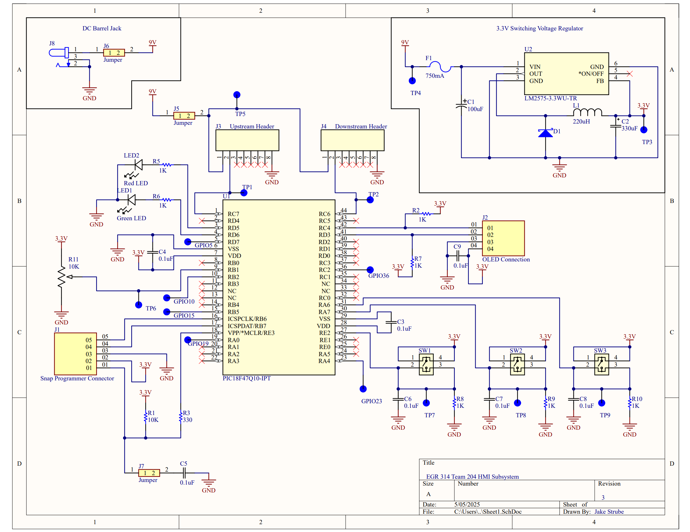
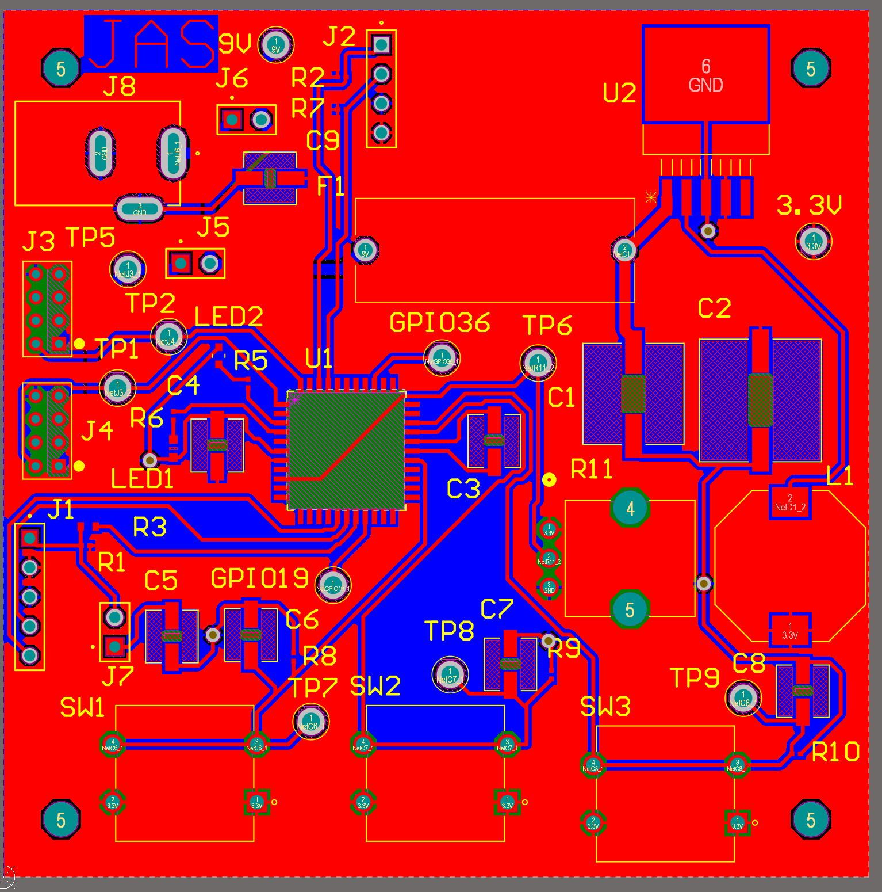
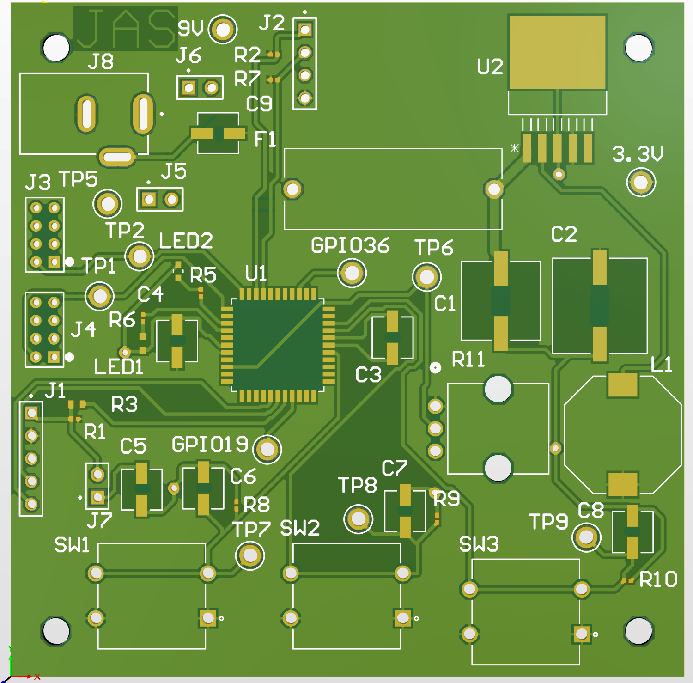
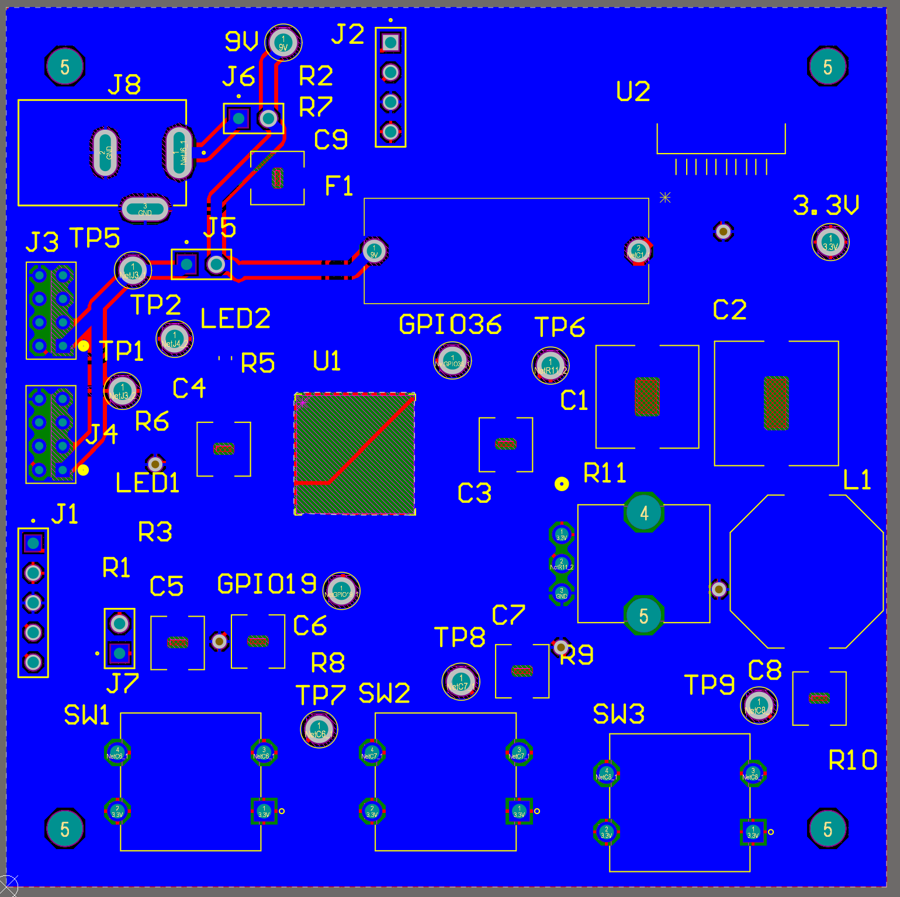
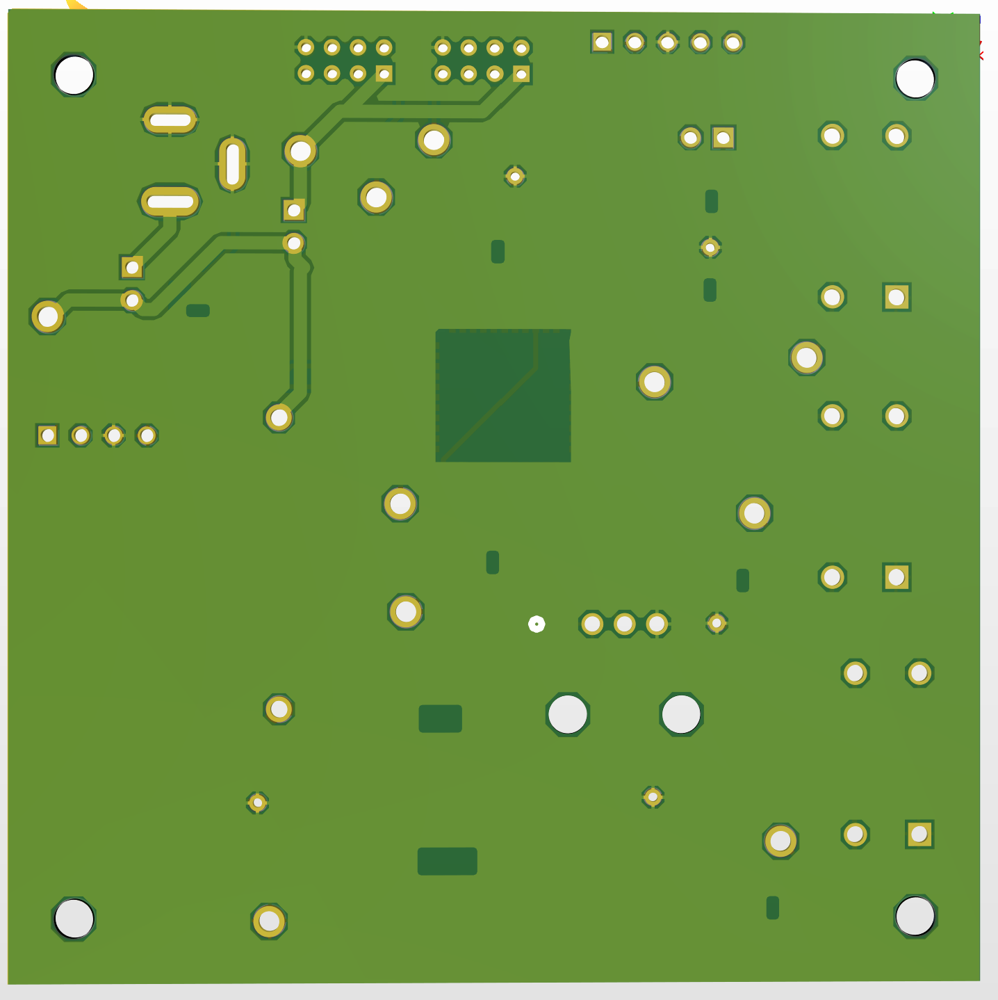
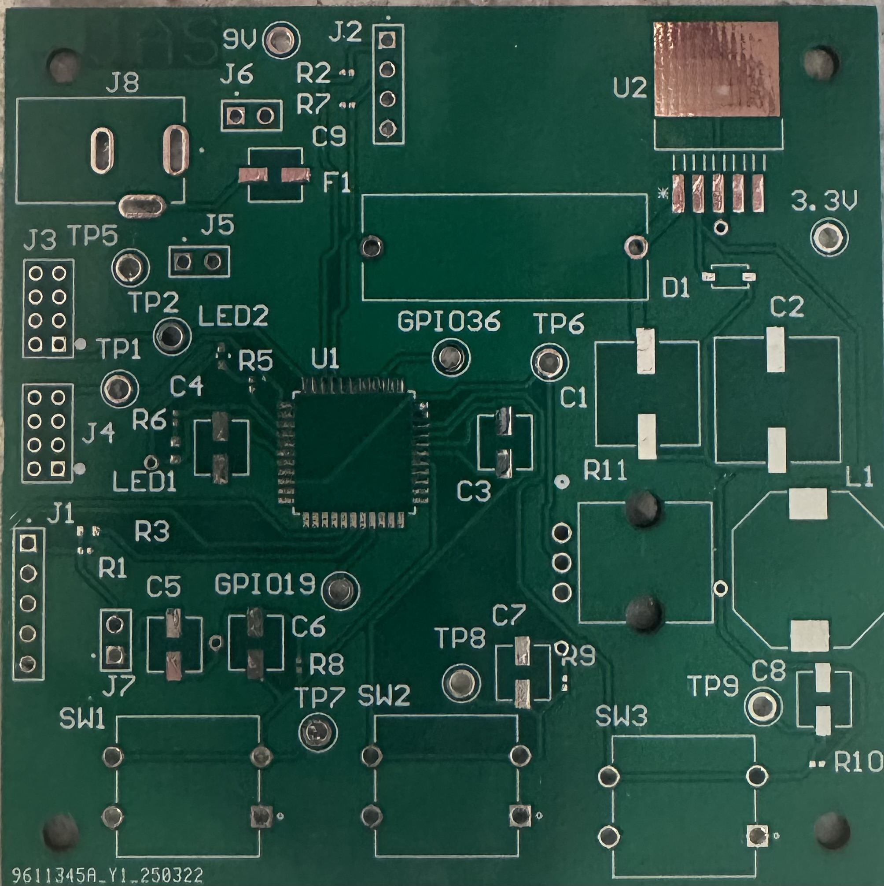
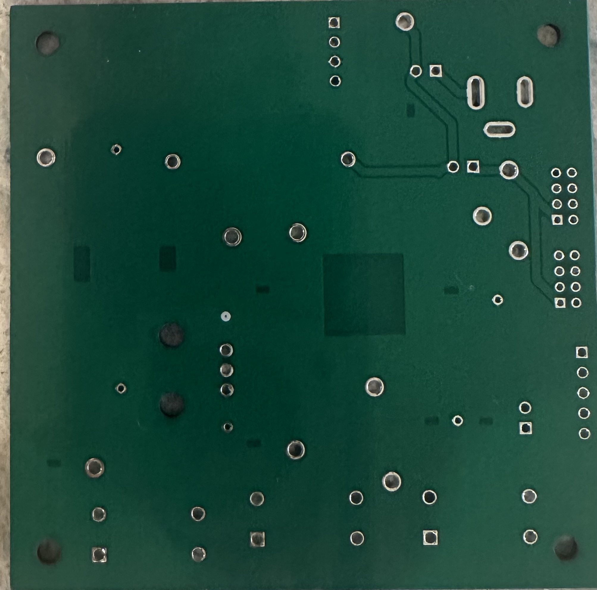
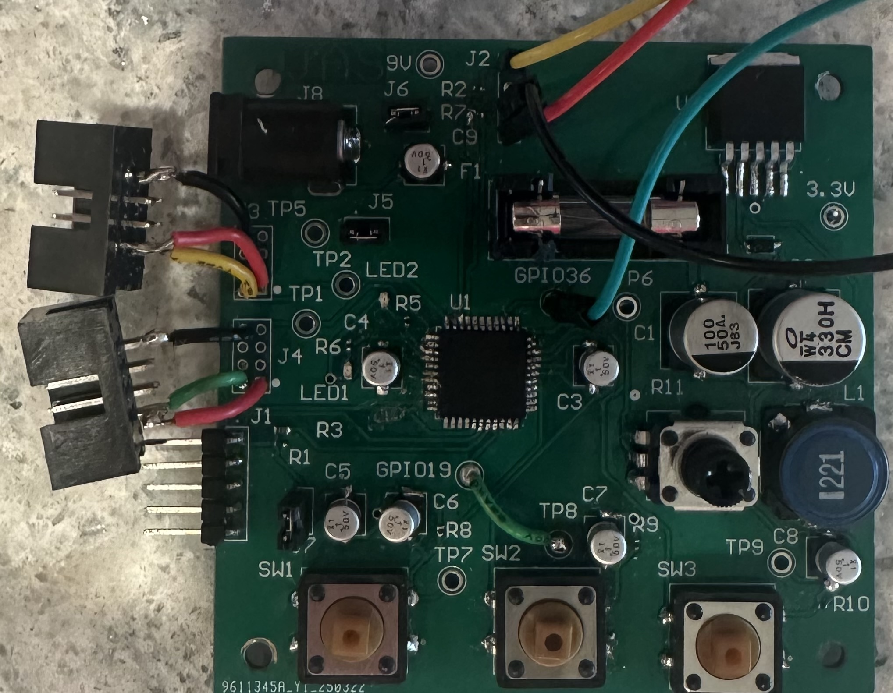
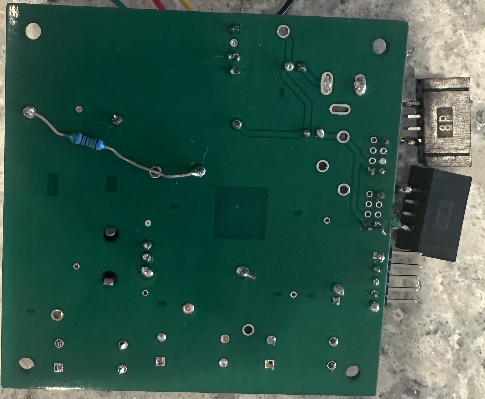

## Schematic Overview

The schematic for Team 204’s HMI subsystem is divided into three main sections: power input, voltage regulation, and the microcontroller with its peripherals. Power is supplied through a barrel jack that connects to an external source and includes a jumper that allows the system to operate independently or as part of a shared power system. The upstream and downstream connectors have a power transfer line that enables 9V to be shared between subsystems. A jumper on this line allows the group power to be disconnected so the board can run on its own power supply. The voltage regulator section in the top right of the schematic receives 9V from either the barrel jack or group power. It passes through a fuse for overload protection before being stepped down to 3.3V to power the microcontroller, OLED screen, and other components. The microcontroller section features three buttons and a potentiometer for user input along with two LEDs, one red and one green, that indicate system activity and provide real-time feedback. To the right of the microcontroller, the OLED screen displays data and instructions. Several test points on GPIO pins allow for future expansion. Two UART connectors above the microcontroller enable communication with upstream and downstream teammates, and additional test points are available for troubleshooting. The schematic follows project constraints, class standards, and good design pracitces to allow it to be flexible, user-friendly, and adaptable for future improvements to ensure a reliable and efficient HMI subsystem for Team 204. 

### Schematic Design

#### Higher Resoultion Image
A higher resoultion image can be found in this [PDF of schematic.](HMI_Subsystem3.pdf)

## PCB Design
Below is the PCB for Team 204's HMI subsystem. The PCB is based off of the schematic above and fits on a 75x75mm board. In each corner is a hole 5mm from the sides that is on all of our team's subsystem boards allowing them all to stack vertically saving space within our device. 
### PCB 
#### Top of PCB
##### Circuit Layout

##### 3D Model

#### Bottom of PCB
##### Circuit Layout

##### 3D Model

#### Higher Resoultion Image
The higher resoultion images can be found in this [PDF of PCB.](PCB-DRC.pdf)

## Manufactured PCB
### Overview 
The PCB was manufactured by JLC using the design shown above. Below both the unpopulated PCB and the populated PCB are shown. The populated PCB is has all the parts from the bill of materials which can be identified by their markers on the silkscreen in white.
### Manufactured Unpopulated PCB
#### Top of  PCB

#### Bottom of PCB

### Issues With The Design
Some Issuses that were encountered with the PCB design that was not discovered till after manufacturing was the two eight pin connectors. The footprint used was to small for the actual part so some modifications to the board were made using deadbugging. Another issue that went unnoticed was the CLK line for I2C was connected to the microcontroller via a pin that would not allow I2C so using an extra GPIO pin a modifcation was made and the CLK line was moved.

### Populated PCB
##### Top of PCB

#### Bottom of PCB

#### Issues After Populating
After fixing the issues found right after manufacturing some more issues arrouse. Some issues were how small the resistors were. Having not much experience with choosing sizing for surface mount parts I did not realize how small my resistors were and had a hard time putting them on but they were all eventually able to be put on. Another issue was one of the microcontroller pins A7 seemed to have broken while I was soldering and did not allow for any input as it was the pin that one of my buttons went into. To fix this problem I used the extra GPIO pin A0 to connect my button to and then the button worked fine. Another issue I came across was with the CLK line for I2C as on the original line there was a resistor but on this new line that I had created using GPIO pin C2. To fix this I soldered a through hole resistor to the GPIO test point and to the 3.3V test point to create that pull up resistor that I originally had.

## Team Decision with PCBs
In our team as mentioned above in the PCB overview our team opted to go for a standard size of 75x75mm with 3mm holes 5mm away from each corner to allow for our PCBs to be stacked veetically. We thought that this would be a good design choice to allow for compact packaging which is key to making our project sucessful as it needs to be able to freely move around. We also shared a lot of design tips and checked each others board to make sure that the connections were good overall. While somethings did get missed on first look they did not impact the overall project in the end. By verifying that we all had met the class standards we were able to make sure that we could all connect without risk of damaging someone else's PCB.

## Improvements to be Made
If I were able to make a version 2.0 to be manufactured some things that I would change would be to organize the board better, change some parts, fix the footprint for the 8 pin connectors, label all my test points and create a ground test point, Make extra room and fix I2C lines so the OLED screen can mount directly onto the PCB, and choose parts that are easier to solder by hand and not to small. The first point I made was to organize the board better. I think that I can do this by placing the buttons more uniformly as right now they are not all evenly spaced or at the same level on the board. Also under organizing the board would be to make room for the OLED screen to be mounted direcly on the PCB as right now I orignally had a space for it to be mounted but I did not account for the size of the fuse which blocks the OLED screen from connecting to its headers. The fuse is a part that I would change if I could redesign the board as the fuse I have right now is huge and takes up a considerable size on the board. I would switch it to a smaller surface mount fuse that still allows for changing out the fuses without having to unsolder the whole thing. I would also fix the footprint for the 8 pin connectors so I no longer have to deadbug my connectors and I would face them so that both of the connectors allow the wires to stick to the outside of the board as found on teammates boards that having the connectors face the same way end up having one of the wires sticking inwards because of the way that the wires are made. I would also label all of my test points. One the best choices I made was on the Silkscreen I labeled the 9V and the 3.3V test points as well as my extra GPIO pin slots and that helped me so much when debugging and checking connections and I wish that I labeled the rest of the test points as well as I wish that I had a ground test point as I kept having to use the barrel jack ground which was stuck in an akward hard to reach spot on my board. Another thing that I would fix is to triple check all of my pin connections and make sure that they work for what I want them to do. I mistakingly made my CLK line for my I2C connect to a pin on the microcontroller that did not support I2C and luckly one of my extra GPIO pins supported I2C but I would make sure that the pin that I connect to the OLED header supports the CLK pin. One last thing I would change is my resistor sizes. It was a new exeperience puting surface mount parts on my PCB but I did not account for how small some of the parts would be and my resistors and my LEDs were very small and it made it difficult to get them all on so I would choose a little bigger components to save on assembly time and parts lost. I think that implementing these changes into a revised design would grealty improve my PCB and would allow me to better suit my team and our project.

## Downloadable files
Below are the files related to the design, production, and check off of the Schematic and PCB

### Design Files
The Files for the PCB and Schematic can be downloaded from this: [HMI System PCB and Schematic zip folder](EGR314_HMISubsystem_files.zip)

### Gerber and Drill Files
The Gerber and Drill files for manufacturing can be downloaded from this: [HMI System Gerber and Drill files zip folder](EGR314_204_HMISubsystem_Gerber.zip)

### Hardware Checkoff Code
The MPLABX code that was used during the in class hardware check off for EGR 314 can be downloaded from this: [MPLABX code zip folder](Team204_HMI_Subsystemcode.zip)

